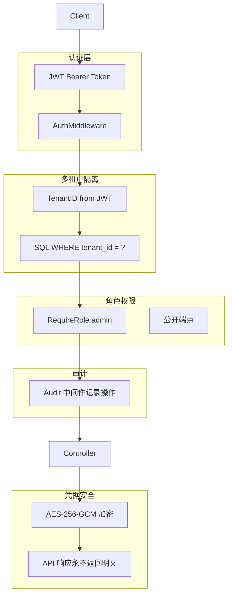
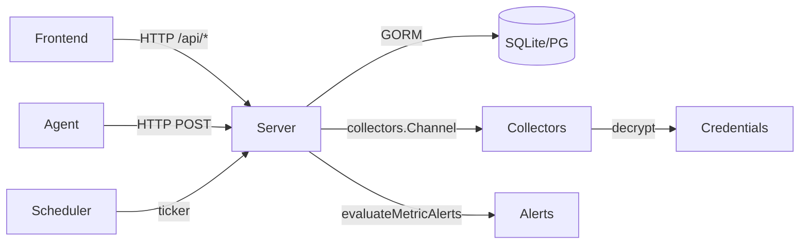

# 系统架构

## 概述

MSMP（Mix System Manage Platform）是一个跨平台服务器运维管理平台，支持统一管理 Windows、Linux、macOS、ESXi 等多类主机。平台通过部署在目标主机上的 Agent 采集本地指标，或通过服务端主动发起远程渠道（SSH、Windows Admin Center、宝塔面板）获取指标，将结果写入 SQLite/PostgreSQL 数据库，由前端通过 echarts 渲染为实时监控曲线，并支持基于阈值的告警联动与 Webhook 通知。

系统采用前后端分离架构：Go 语言后端提供 REST API，React + Ant Design 前端提供交互界面，Agent 以独立二进制运行于目标主机。平台内置多租户隔离（Tenant），每个租户可管理一组主机、配置告警规则、下发远程任务、查看审计日志。

关键能力包括：
- 支持 Agent 采集与无 Agent 远程采集两种模式并存（SSH/WAC/宝塔/vSphere）
- 60 秒周期心跳与 60 秒指标上报，Agent 优先的自动降级策略
- AES-256-GCM 加密存储敏感凭据，API 响应永不明文返回
- 完整的审计日志链路与角色权限控制（admin/member）
- 浏览器内 SSH 终端（WebSocket 代理 + xterm.js）
- 远程文件管理（SFTP，支持上传/下载/目录操作）
- 告警工程化：抑制/静默/升级，防止告警风暴
- MCP AI 工具调用，危险操作人工审批
- ESXi vSphere API 采集（差异化竞争力）

## 技术栈

**语言与运行时**
- Go 1.25+（服务端 + Agent，通过 `GOTOOLCHAIN=auto` 自动下载工具链）
- JavaScript (ES Modules) 18（前端）

**框架**
- 后端：标准 `net/http` + GORM v1.31 + sqlite3/postgres 驱动
- 前端：React 18 + Vite 5 + Ant Design 5 + Zustand + ECharts

**数据存储**
- SQLite（默认，单文件 `msmp.db`）或 PostgreSQL（生产可选）
- GORM AutoMigrate 管理 schema 演进

**基础设施**
- 本地开发：`go.work` 多模块工作区，前端 Vite 反向代理到后端 :8080
- 部署：独立二进制（后端 + Agent）+ 静态文件（前端 dist/）

**外部服务**
- Windows Admin Center REST API（可选）
- 宝塔面板 API（可选）

## 项目结构

```
workspace/
├── agent/                     # 目标主机 Agent（独立二进制）
│   ├── main.go                # 入口：注册、心跳、资产、指标上报循环
│   ├── common/                # 公共逻辑：MetricData、上报、任务轮询
│   │   ├── agent.go           # MetricData / HeartbeatData / RegisterData 定义
│   │   ├── collector.go       # CollectMetrics 函数指针（平台分发）
│   │   ├── platform_posix.go  # POSIX 平台分发
│   │   └── platform_windows.go # Windows 平台分发
│   ├── posix/collect.go       # Linux/macOS 采集实现（gopsutil v3）
│   ├── win/collect.go         # Windows 采集实现（WMI/PerformanceCounter）
│   └── platform/              # 平台抽象层
├── server/                    # 后端服务
│   ├── main.go                # 路由注册、中间件、启动调度器
│   ├── config/                # 配置加载（viper + YAML）
│   │   └── config.go          # Config 结构体与 Load()
│   ├── db/                    # 数据库初始化与迁移
│   │   └── db.go              # Init() + AutoMigrate
│   ├── models/                # GORM 数据模型
│   │   └── models.go          # 全部表结构定义
│   ├── controllers/           # HTTP 处理层
│   │   ├── auth.go            # 登录、token 刷新
│   │   ├── middleware.go      # JWT 认证、租户隔离、Audit、RequireRole
│   │   ├── hosts.go           # 主机 CRUD 与详情（含 channels 子资源）
│   │   ├── channels.go        # 渠道 CRUD、probe、ssh-keypair、CollectorScheduler
│   │   ├── metrics.go         # 监控数据查询
│   │   ├── alerts.go          # 告警列表与 evaluateMetricAlerts
│   │   ├── alert_rules.go     # 告警规则 CRUD
│   │   ├── agent_assets.go    # Agent 注册/心跳/资产/指标上报处理
│   │   ├── agent_tokens.go    # Agent Token 管理
│   │   ├── tasks.go           # 远程任务管理
│   │   ├── tenants.go         # 租户管理
│   │   ├── users.go           # 用户管理
│   │   ├── audit.go           # 审计日志查询
│   │   └── settings.go        # 系统设置
│   ├── collectors/            # 无 Agent 采集渠道
│   │   ├── channel.go         # Channel 接口、Registry、MetricDataLike
│   │   ├── ssh.go             # SSH 渠道：/proc 解析
│   │   ├── wac.go             # Windows Admin Center 渠道
│   │   ├── baota.go           # 宝塔面板渠道
│   │   └── vsphere.go         # vSphere/ESXi 渠道：govmomi API
│   ├── services/              # 共享服务
│   │   └── credential.go      # CredentialService（AES-256-GCM）+ GlobalCredSvc
│   ├── controllers/
│   │   ├── webssh.go          # WebSocket→SSH 代理
│   │   ├── sftp.go            # SFTP 文件管理（list/download/upload/delete/rename/mkdir）
│   │   ├── alert_engine.go    # 告警工程化（抑制/静默/升级）
│   │   └── alert_engine_api.go # 告警工程化 API
│   ├── config.yaml            # 示例配置
│   └── msmp.db                # SQLite 数据库（开发时）
├── frontend/                  # React 前端
│   ├── package.json           # 依赖：antd、echarts、zustand、vite
│   ├── vite.config.js         # 开发服务器 + /api 反向代理
│   ├── index.html             # SPA 入口
│   └── src/
│       ├── main.jsx           # React 入口
│       ├── App.jsx            # 路由与认证守卫
│       ├── api/client.js      # axios 实例（自动附加 Authorization）
│       ├── layouts/MainLayout.jsx  # 侧边栏 + 顶栏布局
│       ├── store/auth.js      # Zustand 认证状态
│       ├── styles/global.css  # 全局样式
│       └── pages/             # 页面组件
│           ├── Dashboard.jsx      # 概览
│           ├── HostList.jsx       # 主机列表
│           ├── HostDetail.jsx     # 主机详情（含采集渠道 tab）
│           ├── Monitor.jsx        # 监控曲线页
│           ├── Alerts.jsx         # 告警列表
│           ├── AlertRules.jsx     # 告警规则
│           ├── Tasks.jsx          # 任务列表
│           ├── TaskDetail.jsx     # 任务详情
│           ├── Tenants.jsx        # 租户管理
│           ├── Users.jsx          # 用户管理
│           ├── AgentTokens.jsx    # Agent Token 生成
│           ├── AuditLogs.jsx      # 审计日志
│           ├── Settings.jsx       # 系统设置
│           ├── Login.jsx          # 登录
│           └── NotFound.jsx       # 404
├── go.work                    # Go 多模块工作区
└── README.md
```

## 子系统

### 后端服务（server）

**目的**: 提供 REST API，存储主机资产与指标数据，执行告警评估，调度无 Agent 采集任务。

**位置**: `server/`

**关键文件**: `main.go`、`controllers/channels.go`、`controllers/middleware.go`、`models/models.go`

**依赖**: GORM、sqlite3/postgres、golang-jwt/jwt、golang.org/x/crypto、spf13/viper

**被依赖**: 前端通过 `/api/*` 反向代理访问；Agent 通过 HTTP POST 上报

### 主机 Agent（agent）

**目的**: 部署在目标主机上，每 60 秒采集 CPU/内存/磁盘/网络/负载/运行时长并上报服务端。

**位置**: `agent/`

**关键文件**: `main.go`、`common/agent.go`、`posix/collect.go`、`win/collect.go`

**依赖**: gopsutil v3（跨平台系统信息采集）

**被依赖**: 无（独立二进制，与服务端无双向依赖）

### 前端应用（frontend）

**目的**: 提供 Web UI，展示主机列表、监控曲线、告警状态、任务下发、租户管理。

**位置**: `frontend/`

**关键文件**: `src/App.jsx`、`src/pages/HostDetail.jsx`、`src/pages/Monitor.jsx`

**依赖**: React 18、Ant Design 5、ECharts、Zustand、Vite 5

**被依赖**: 无

### 采集调度器（CollectorScheduler）

**目的**: 服务端后台 goroutine，周期性对未安装 Agent 的主机发起远程指标采集。

**位置**: `server/controllers/channels.go`（`runCollectorScheduler` / `collectCycle` / `collectHost`）

**关键文件**: `controllers/channels.go`、`collectors/ssh.go`、`collectors/wac.go`、`collectors/baota.go`

**依赖**: `collectors.Channel` 接口实现、`services.CredentialService`

**被依赖**: 无（自驱动后台任务）

### 凭据服务（CredentialService）

**目的**: 对 SSH 密码/私钥、宝塔 API Key、WAC 网关 Token 等敏感凭据进行 AES-256-GCM 加密/解密。

**位置**: `server/services/credential.go`

**关键文件**: `services/credential.go`

**依赖**: crypto/aes、crypto/cipher、crypto/rand、encoding/base64、golang.org/x/crypto/ssh

**被依赖**: `controllers/channels.go`、所有 Channel 实现

## 数据流

```mermaid
flowchart LR
    subgraph Agent["Agent 采集路径"]
        A1[Agent 进程] -->|每 60s POST| A2[/api/agents/metrics]
        A1 -->|每 30s POST| A3[/api/agents/heartbeat]
        A1 -->|每 5min POST| A4[/api/agents/assets]
    end

    subgraph Server["后端服务"]
        S1[HTTP Handler] --> S2[GORM]
        S2 --> S3[(SQLite / PG)]
        S1 --> S4[evaluateMetricAlerts]
        S4 --> S2
    end

    subgraph Scheduler["无 Agent 采集路径"]
        SC1[CollectorScheduler] -->|ticker 60s| SC2[候选主机查询]
        SC2 --> SC3[按 Priority 降级]
        SC3 --> SC4[SSH/WAC/宝塔 Channel]
        SC4 --> S1
    end

    subgraph Frontend["前端"]
        F1[React UI] -->|axios GET /api/*| F2[Vite dev proxy]
        F2 -->|/api/* → localhost:8080| S1
    end

    subgraph External["外部目标主机"]
        E1[Linux host /proc] -->|SSH| SC4
        E2[WAC 网关] -->|HTTPS| SC4
        E3[宝塔面板] -->|HTTPS| SC4
    end

    A2 --> S1
    A3 --> S1
    A4 --> S1
    F1 --> F2
```

## 安全架构



## 子系统依赖关系


