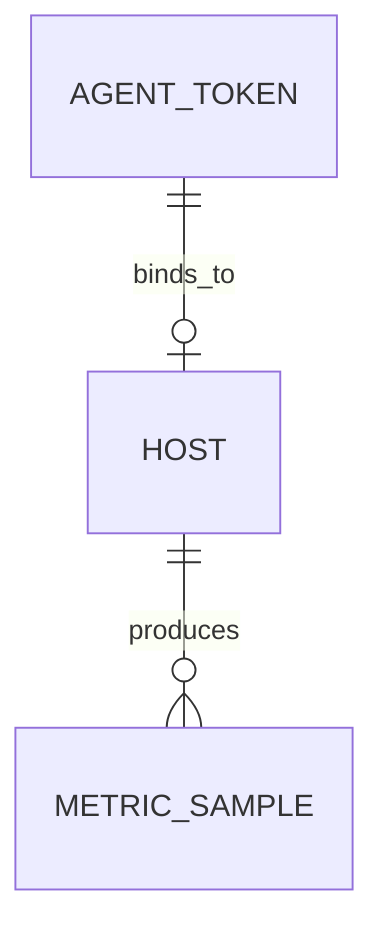

# AgentToken

AgentToken 是 Agent 注册到服务端的身份凭据。每个 Token 对应一个主机，Agent 启动时携带 Token 完成注册、心跳和指标上报。

## 什么是 AgentToken？

AgentToken 是连接 Agent 与服务端的桥梁。管理员在平台生成 Token 后，将对应的一键安装命令复制到目标主机执行，Agent 即完成注册并成为可管理的主机。

**关键特征**:
- Token 字符串全局唯一（`uniqueIndex`）
- 可选择绑定到已有主机（`host_id`）或留空（新注册时自动绑定）
- 支持设置过期时间（`expires_at`）和吊销（`revoked`）
- 一份 Token 可生成 Linux/Windows/macOS 三种架构的安装命令

## 代码位置

| 方面 | 位置 |
|------|------|
| 模型 | `server/models/models.go` L61-L70 |
| API 路由 | `server/controllers/agent_tokens.go` |
| Agent 使用 | `agent/common/agent.go` Register / Heartbeat |
| 前端页面 | `frontend/src/pages/AgentTokens.jsx` |
| 数据库表 | `agent_tokens` |

## 结构

```go
type AgentToken struct {
    ID          uint
    TenantID    uint
    HostID      *uint     // 可选，绑定到已有主机
    Token       string    // 64 字符随机字符串
    Description string
    ExpiresAt   *time.Time
    Revoked     bool
    CreatedAt   time.Time
}
```

## 关系



| 关联概念 | 关系 | 描述 |
|---------|------|------|
| Host | 绑定 | Token 可选择绑定到一个 Host |
| Host | 产出 | 绑定 Host 通过 Token 上报指标 |
