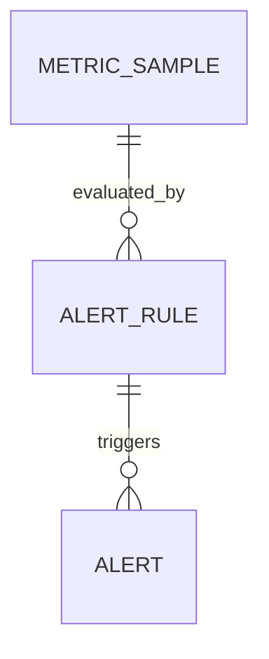

# AlertRule

AlertRule 是基于主机性能指标阈值的告警规则。当 MetricSample 的某个字段满足规则条件时，系统自动生成 Alert 记录并可选择触发 Webhook 通知。

## 什么是 AlertRule？

AlertRule 定义了"何时告警"的判定逻辑：哪个指标、用何种比较运算符、超过什么阈值、告警级别是什么。每条新指标落库后立即触发评估，命中规则则生成告警事件。

**关键特征**:
- 支持 `gt`、`gte`、`lt`、`lte` 四种比较运算符
- 告警级别分为 `info`、`warning`、`critical`
- 规则可启用/禁用，不影响历史告警记录
- Webhook URL 在系统设置中配置，命中时异步 POST 通知

## 代码位置

| 方面 | 位置 |
|------|------|
| 模型 | `server/models/models.go` L111-L123 |
| 评估逻辑 | `server/controllers/alerts.go` evaluateMetricAlerts |
| API 路由 | `server/controllers/alert_rules.go` |
| 前端页面 | `frontend/src/pages/AlertRules.jsx`、`frontend/src/pages/Alerts.jsx` |
| 数据库表 | `alert_rules` |

## 结构

```go
type AlertRule struct {
    ID         uint
    TenantID   uint
    Name       string
    Metric     string    // cpu_percent | mem_percent | load1 | net_rx_bps 等
    Operator   string    // gt | gte | lt | lte
    Threshold  float64
    Level      string    // info | warning | critical
    Enabled    bool
    CreatedAt  time.Time
    UpdatedAt  time.Time
    DeletedAt  gorm.DeletedAt
}
```

## 不变量

1. **租户隔离**: 规则仅对当前租户的主机生效。
2. **指标字段对齐**: `metric` 字段必须对应 MetricSample 的合法字段名。
3. **评估幂等**: 同一条 MetricSample 可能被多条规则评估，各规则独立产出告警。

## 关系



| 关联概念 | 关系 | 描述 |
|---------|------|------|
| Alert | 触发 | 规则命中时生成 Alert 记录 |
| MetricSample | 被评估 | 每条样本触发所有启用规则的评估 |
