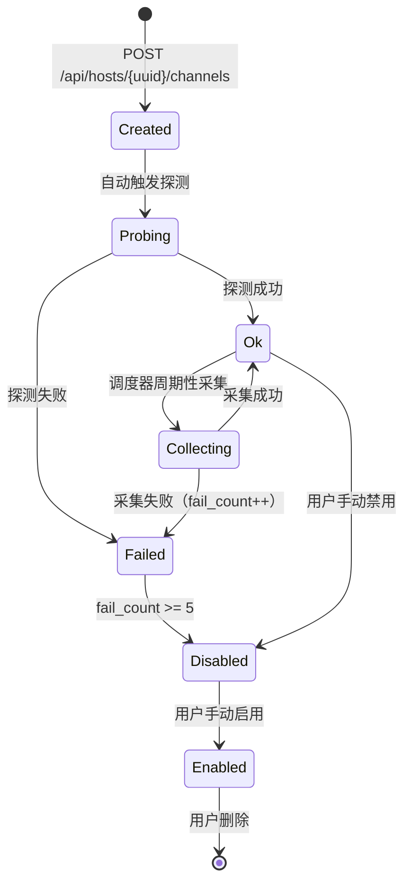
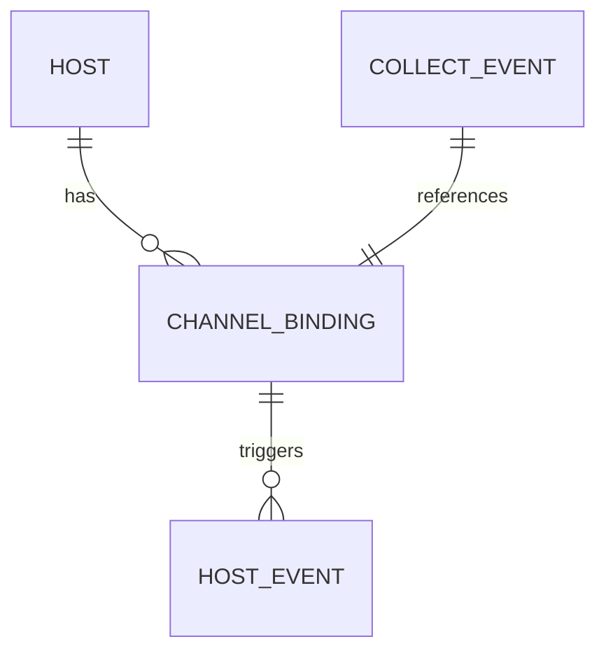

# ChannelBinding

ChannelBinding 是无 Agent 采集渠道与主机的绑定配置，定义了服务端如何通过远程方式采集某台主机的性能指标。

## 什么是 ChannelBinding？

ChannelBinding 是 MSMP 无 Agent 采集能力的核心数据模型。每台主机可以绑定多个渠道（SSH、WAC、宝塔面板），服务端采集调度器按优先级顺序尝试，首个成功的渠道结果作为本次采集结果。

**关键特征**:
- 凭据（密码/私钥/API Key）经 AES-256-GCM 加密存储，API 响应永不返回明文
- 支持优先级排序（数字小优先）与启用/禁用状态
- 创建后自动触发一次连通性探测
- 连续失败 5 次自动禁用

## 代码位置

| 方面 | 位置 |
|------|------|
| 模型 | `server/models/models.go` L162-L179 |
| API 路由 | `server/controllers/channels.go` |
| 采集实现 | `server/collectors/`（channel.go、ssh.go、wac.go、baota.go） |
| 前端页面 | `frontend/src/pages/HostDetail.jsx`「采集渠道」tab |
| 数据库表 | `channel_bindings` |

## 结构

```go
type ChannelBinding struct {
    ID          uint
    TenantID    uint
    HostID      uint
    Type        string    // ssh | wac | baota
    Address     string    // host:port 或网关/面板 URL
    AuthMode    string    // password | private_key | generated_key | api_key | gateway
    Username    string
    Credential  string    // AES-256-GCM 密文 base64，json:"-" 永不返回
    Priority    int       // 数字小优先，默认 100
    Enabled     bool
    LastProbeAt *time.Time
    LastStatus  string    // ok | unreachable | auth_failed | denied | unsupported | parse_error
    FailCount   int
    CreatedAt   time.Time
    UpdatedAt   time.Time
    DeletedAt   gorm.DeletedAt
}
```

### 关键字段

| 字段 | 类型 | 描述 | 约束 |
|------|------|------|------|
| `type` | string | 渠道类型 | ssh / wac / baota |
| `auth_mode` | string | 接入方式 | 按 type 可选值不同 |
| `credential` | string | 加密凭据 | 落库密文，响应中不存在 |
| `priority` | int | 优先级 | 数字小优先，同类型防重复启用 |
| `last_status` | string | 最近探测/采集状态 | 6 种固定枚举值 |
| `fail_count` | int | 连续失败次数 | ≥5 时自动禁用 |

## 不变量

1. **同类型唯一启用**: 同一主机同一租户下，启用状态的 (host_id, type) 组合最多一条。创建时检查并拒绝冲突。
2. **凭据脱敏**: 任何 API 响应中 `credential` 字段不存在（struct tag `json:"-"`）。
3. **失败阈值**: `fail_count >= 5` 时绑定自动置为 `enabled = false`。

## 生命周期



## 关系



| 关联概念 | 关系 | 描述 |
|---------|------|------|
| Host | 属于 | 每个 ChannelBinding 属于一个 Host |
| CollectEvent | 触发 | 采集失败时生成 CollectEvent 记录 |
| Channel | 实现 | 每个 type 对应一个 Channel 实现（SSH/WAC/宝塔） |

## SSH 接入方式

| auth_mode | 说明 | 适用场景 |
|-----------|------|----------|
| `password` | 密码直连 | 有登录密码的场景 |
| `private_key` | 用户自带私钥（PEM 格式） | 已有密钥对的场景 |
| `generated_key` | 平台生成密钥对 | 推荐方式，平台生成并输出一键安装公钥命令 |
