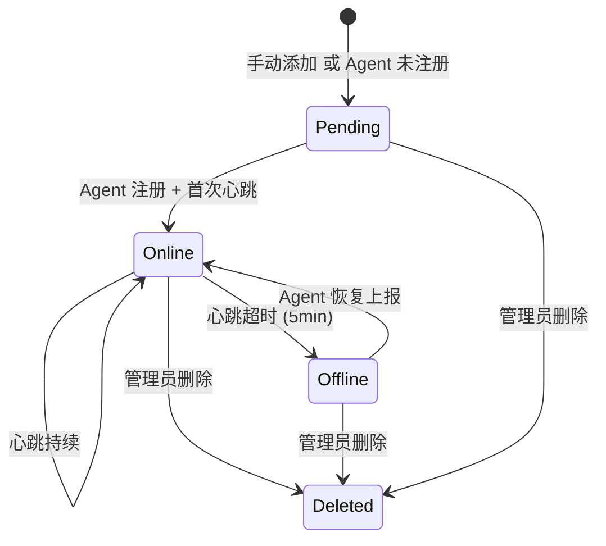
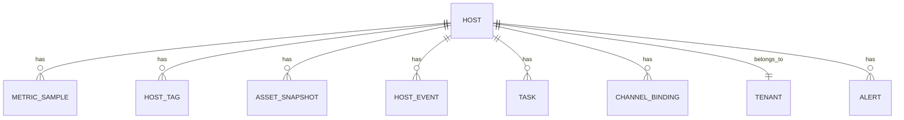

# Host

Host 是 MSMP 中被管理的主机实体，代表一台物理机、虚拟机或容器。每个 Host 属于一个 Tenant，通过 UUID 唯一标识。

## 什么是 Host？

Host 代表一台待监控的服务器。它可以由 Agent 主动注册（安装 Agent 后自动上报），也可以由管理员手动添加（创建时状态为 pending）。主机状态随心跳更新：收到心跳/指标则 online，超时则 offline。

**关键特征**:
- 每个 Host 有唯一 UUID，Agent 注册时生成
- 资产信息（主机名、OS、CPU、内存、磁盘）由 Agent 或采集渠道上报
- 指标数据写入 MetricSample，用于前端监控曲线渲染
- 可配置多个无 Agent 采集渠道作为 Agent 不可用时的降级方案

## 代码位置

| 方面 | 位置 |
|------|------|
| 模型 | `server/models/models.go` L30-L51 |
| API 路由 | `server/controllers/hosts.go` |
| Agent 注册 | `server/controllers/agent_assets.go` AgentRegisterHandler |
| 前端页面 | `frontend/src/pages/HostList.jsx`、`frontend/src/pages/HostDetail.jsx` |
| 数据库表 | `hosts` |

## 结构

```go
type Host struct {
    ID            uint
    TenantID      uint
    UUID          string    // 唯一标识，Agent 注册时生成
    Hostname      string
    OS            string    // linux / windows / darwin
    OSVersion     string
    Arch          string    // amd64 / arm64
    IP            string
    PublicIP      string
    CPUModel      string
    CPUCores      int
    MemoryTotal   uint64
    DiskTotal     uint64
    AgentVersion  string
    Status        string    // pending / online / offline
    LastHeartbeat *time.Time
    RegisteredAt  time.Time
    CreatedAt     time.Time
    UpdatedAt     time.Time
    DeletedAt     gorm.DeletedAt
}
```

### 关键字段

| 字段 | 类型 | 描述 | 约束 |
|------|------|------|------|
| `uuid` | string | 唯一标识 | UUID v4，不可变 |
| `tenant_id` | uint | 所属租户 | 必须存在于 tenants 表 |
| `status` | string | 运行状态 | pending / online / offline |
| `last_heartbeat` | *time.Time | 最后心跳时间 | null 表示从未连接 |

## 不变量

1. **租户隔离**: 同一租户下不同 Host 的 UUID 唯一；跨租户 UUID 可重复（但不建议）。
2. **状态同步**: `status = "online"` 当且仅当 `last_heartbeat` 距今在 5 分钟以内（由 Agent 上报或采集调度器更新）。
3. **软删除**: Host 被删除时走 GORM soft delete（`DeletedAt`），不复写主键。

## 生命周期



### 状态描述

| 状态 | 描述 | 允许的转换 |
|------|------|-----------|
| `pending` | 已创建但未建立连接 | → online, offline, deleted |
| `online` | 正常活跃 | → offline, online, deleted |
| `offline` | 失联 | → online, deleted |
| `deleted` | 软删除 | （终态） |

## 关系



| 关联概念 | 关系 | 描述 |
|---------|------|------|
| Tenant | 属于 | 每个 Host 属于一个 Tenant |
| MetricSample | 拥有 | 一个 Host 有多条指标样本 |
| ChannelBinding | 拥有 | 一个 Host 可配置多个采集渠道 |
| AgentToken | 关联 | Agent 注册时可绑定到 Host |
| Task | 拥有 | 可向 Host 下发远程任务 |
