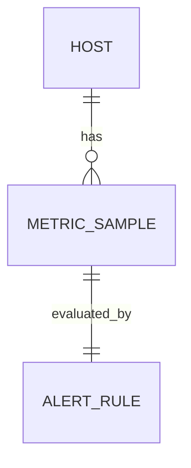

# MetricSample

MetricSample 是单个时间点的主机性能指标快照，记录 CPU 使用率、内存用量、磁盘用量、网络流量、系统负载和运行时长。

## 什么是 MetricSample？

MetricSample 是监控数据的核心存储单元。每次 Agent 上报或无 Agent 渠道采集成功，都会向 `metric_samples` 表写入一条记录。前端监控曲线由该表的查询结果渲染。

**关键特征**:
- 复合索引 `(host_id, timestamp)` 保证按主机时间范围查询高效
- 字段语义与 Agent 端 `common.MetricData` 严格对应
- 无 Agent 渠道采集写入的数据与 Agent 上报数据在同一张表中，前端无感知差异

## 代码位置

| 方面 | 位置 |
|------|------|
| 模型 | `server/models/models.go` L80-L97 |
| 写入入口 | `server/controllers/agent_assets.go` AgentMetricReportHandler |
| 查询接口 | `server/controllers/metrics.go` MetricsHandler |
| 前端展示 | `frontend/src/pages/Monitor.jsx`、`frontend/src/pages/HostDetail.jsx` |
| 数据库表 | `metric_samples` |

## 结构

```go
type MetricSample struct {
    ID         uint
    TenantID   uint
    HostID     uint
    Timestamp  time.Time
    CPUPercent float64
    MemPercent float64
    MemUsed    uint64
    MemTotal   uint64
    DiskUsed   uint64
    DiskTotal  uint64
    NetRxBps   uint64
    NetTxBps   uint64
    Load1      float64
    Load5      float64
    Load15     float64
    UptimeSec  uint64
}
```

### 关键字段

| 字段 | 类型 | 描述 | 语义说明 |
|------|------|------|----------|
| `cpu_percent` | float64 | CPU 使用率 | 0-100，gopsutil 1秒窗口平均值 |
| `mem_percent` | float64 | 内存使用率 | 0-100 |
| `mem_used` / `mem_total` | uint64 | 内存已用/总量 | 字节 |
| `disk_used` / `disk_total` | uint64 | 磁盘已用/总量 | 字节，所有分区累加 |
| `net_rx_bps` / `net_tx_bps` | uint64 | 网络累计收发字节 | **注意：是累计值，非每秒速率** |
| `load1` / `load5` / `load15` | float64 | 系统负载 | 1/5/15 分钟平均 |
| `uptime_sec` | uint64 | 运行时长 | 秒 |

## 不变量

1. **每主机每分钟至多一条**: 实际采样间隔为 60 秒，理论上不会有重复 timestamp，但无唯一约束强制。
2. **字段完整性**: 所有数值字段均允许为零值，表示该指标不可用或采集失败。
3. **租户隔离**: 查询必须按 `tenant_id` 过滤，防止跨租户数据泄漏。

## 关系



| 关联概念 | 关系 | 描述 |
|---------|------|------|
| Host | 拥有 | 每个 MetricSample 属于一个 Host |
| AlertRule | 被评估 | 每条样本触发告警规则评估 |

## 已知限制

`net_rx_bps` / `net_tx_bps` 存储的是 IOCounters 的**累计字节数**，而非每秒速率。前端 `formatNet` 直接绘制会呈现单调递增曲线，语义上更接近"累计流量"而非"当前速率"。如需真正的 bps，需在 Agent 端对两次采样求差再除间隔，或在后端做差分处理。
