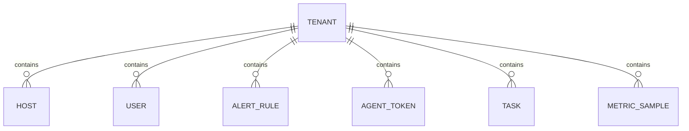

# Tenant

Tenant 是 MSMP 多租户隔离的最小单位。每个 Tenant 拥有独立的主机、用户、规则和数据，租户间数据完全隔离。

## 什么是 Tenant？

Tenant 代表一个独立的管理域（如一个团队、一个项目、一个客户）。所有业务数据（主机、用户、告警规则、任务等）都绑定到某个 Tenant，API 请求通过 JWT 中的 tenant_id 进行隔离。

**关键特征**:
- Slug 全局唯一，用于 URL 标识
- 每个 Tenant 可创建多个 User
- 数据库查询始终附加 `WHERE tenant_id = ?`

## 代码位置

| 方面 | 位置 |
|------|------|
| 模型 | `server/models/models.go` L9-L16 |
| API 路由 | `server/controllers/tenants.go` |
| 前端页面 | `frontend/src/pages/Tenants.jsx` |
| 数据库表 | `tenants` |

## 结构

```go
type Tenant struct {
    ID        uint
    Name      string
    Slug      string    // 唯一标识符，如 "default"
    CreatedAt time.Time
    UpdatedAt time.Time
    DeletedAt gorm.DeletedAt
}
```

## 关系


