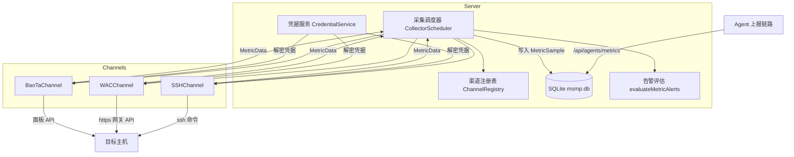
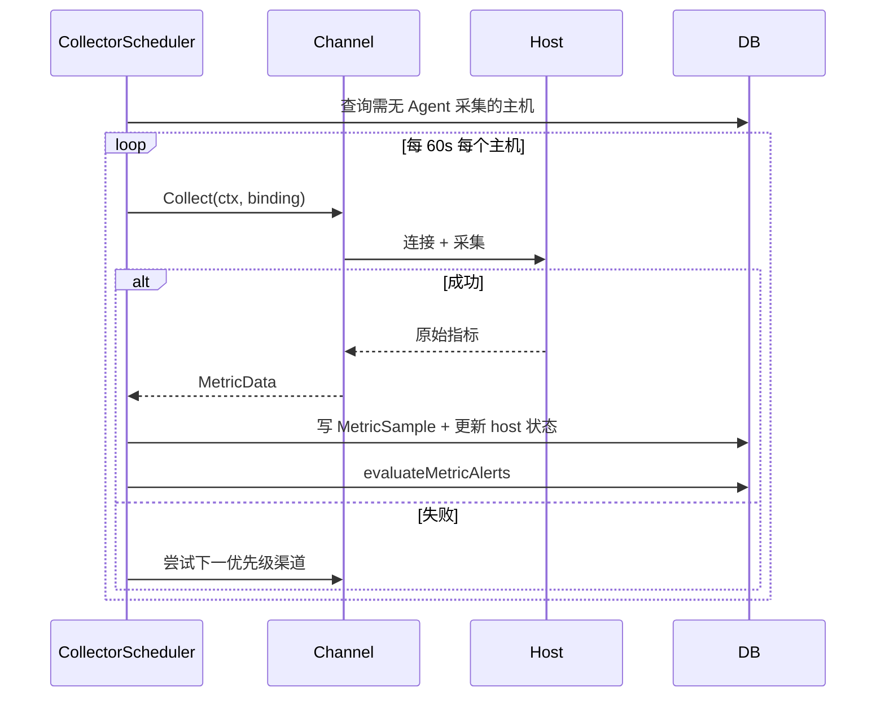

# 无 Agent 多通道采集

Feature Name: agentless-metrics-channels
Updated: 2026-09-01

## Description

为 MSMP 平台增加服务端主动采集能力。当主机无法安装 Agent 时，服务端通过 SSH、Windows Admin Center（WAC）网关、宝塔面板三类渠道远程获取性能指标与基础资产信息。渠道按优先级自动降级，采集结果写入既有 MetricSample 链路，监控、告警、前端展示逻辑全部复用。每种渠道提供多种自动化接入方式，由用户根据现场条件自选。

技术决策（基于默认推荐项）：
- 凭据加密：AES-256-GCM，主密钥来自 server/config.yaml 新增 `security.credential_key`
- SSH 采集：golang.org/x/crypto/ssh 建立会话执行只读命令，不在目标主机落地任何文件
- 调度切换：全自动，Agent 优先。主机 5 分钟内收到 Agent 上报则跳过无 Agent 采集

## Architecture



关键时序：



## Components and Interfaces

### 1. Channel 接口（server/collectors/channel.go 新增）

```go
type CollectResult struct {
    Metrics    MetricDataLike  // 与 agent 端 MetricData 字段对等的 DTO
    Missing    []string        // 该渠道采集不到的字段名
    Duration   time.Duration
}

type Channel interface {
    Type() string                      // "ssh" | "wac" | "baota"
    Probe(ctx, binding) (ProbeResult, error)    // 连通性探测
    Collect(ctx, binding) (CollectResult, error) // 指标采集
}
```

- `SSHChannel`：x/crypto/ssh，`/proc/stat`、`/proc/meminfo`、`df -P`、`/proc/net/dev`、`/proc/loadavg`、`/proc/uptime`、`hostname`、`uname -m`、`lscpu`。资产字段在首次成功采集时同步进 host 表。
- `WACChannel`：调用 WAC 网关 REST API（性能计数器节点），认证失败/权限不足映射为固定错误分类。缺项字段写入 Missing。
- `BaoTaChannel`：面板 API（系统状态接口），HMAC 签名请求，解析失败标记渠道解析错误。

### 2. CollectorScheduler（server/collectors/scheduler.go 新增）

- `time.Ticker(60s)` 驱动，对每个候选主机串行按优先级尝试渠道。
- 候选条件：存在启用的 ChannelBinding 且 `last_heartbeat` 距今 > 5 分钟（含 from agent），或主机 status 为 pending/offline。
- 全部失败：写 HostEvent（type=collect_failed），host.status=offline；单渠道连续失败计数达到 5 自动禁用该绑定并产生 Alert。
- 并发控制：worker pool 默认 8，单主机采集超时 20 秒。

### 3. CredentialService（server/services/credential.go 新增）

- AES-256-GCM，密钥 32 字节，从 `security.credential_key`（base64）读取。
- 提供 `Encrypt(plaintext)` / `Decrypt(bindingID)`；API 层永不输出明文。
- 服务端未配置密钥时，创建带凭据的绑定直接返回 503。

### 4. HTTP API（server/controllers/ 新增 channels.go）

| Method | Path | 说明 |
|---|---|---|
| GET | `/api/hosts/:id/channels` | 列出主机通道绑定（脱敏） |
| POST | `/api/hosts/:id/channels` | 创建绑定（含 type/addr/auth/params/priority），创建后自动触发探测 |
| PUT | `/api/channels/:id` | 更新（启用/禁用/优先级/参数） |
| DELETE | `/api/channels/:id` | 删除绑定并清理凭据 |
| POST | `/api/channels/:id/probe` | 手动探测，15s 超时 |
| POST | `/api/channels/ssh-keypair` | 生成临时密钥对，返回公钥与一键安装命令 |

全部走现有 middleware 鉴权与租户隔离，写操作记录审计日志。

### 5. 前端

- HostDetail.jsx 新增「采集渠道」tab：列表、新增向导（逐渠道按接入方式分步表单）、探测按钮、状态徽标。
- Monitor.jsx 不变（数据链路透明）。
- 主机详情展示当前生效渠道与最近采集时间。

## Data Models

新增两张表：

```go
type ChannelBinding struct {
    ID          uint      `gorm:"primaryKey"`
    TenantID    uint      `gorm:"index;not null"`
    HostID      uint      `gorm:"index;not null"`
    Type        string    `gorm:"size:16"`      // ssh | wac | baota
    Address     string    `gorm:"size:255"`     // host:port 或网关/面板 URL
    AuthMode    string    `gorm:"size:16"`      // password | private_key | generated_key | api_key | gateway
    Username    string    `gorm:"size:64"`
    Credential  string    `gorm:"type:text"`    // AES-GCM 密文 base64
    Priority    int       `gorm:"default:100"`  // 数字小优先
    Enabled     bool      `gorm:"default:true"`
    LastProbeAt *time.Time
    LastStatus  string    `gorm:"size:32"`      // ok / unreachable / auth_failed / denied / unsupported / parse_error
    FailCount   int       `gorm:"default:0"`
    CreatedAt, UpdatedAt time.Time
    DeletedAt   gorm.DeletedAt
}

type CollectEvent struct {   // 采集失败事件，用于审计与排障
    ID, TenantID, HostID, ChannelID uint
    Type, Message string
    CreatedAt time.Time
}
```

`db/db.go` 自动迁移中加入这两个模型。MetricSample 不改表结构。

## Correctness Properties

1. 同一主机同一租户下，启用状态的 (host_id, type) 组合唯一。
2. 任何 API 响应中 Credential 字段恒为空。
3. 对任意主机，一个调度周期内至多写入一条 MetricSample。
4. 主机的 last_heartbeat 5 分钟内有 Agent 样本时，该周期内调度器对该主机不产生任何渠道连接尝试。
5. SSH 渠道采集的 net_rx/net_tx 语义与 Agent 一致（累计字节）。
6. 凭据解密失败时绑定直接标记不可用，不发起网络连接。

## Error Handling

| 场景 | 行为 |
|---|---|
| 网络不可达 / 连接超时 | 15s 探测超时、20s 采集超时；LastStatus=unreachable，尝试下一渠道 |
| 认证失败 | LastStatus=auth_failed，FailCount+1，不再重试本周期内该渠道 |
| 权限不足（WAC/宝塔） | LastStatus=denied，返回可操作提示 |
| 渠道数据结构变更解析失败 | LastStatus=parse_error，写 CollectEvent 告警 |
| 全部渠道失败 | host.status=offline + HostEvent |
| 凭据密钥未配置 | 创建绑定返回 503，提示在 config.yaml 配置 security.credential_key |

## Test Strategy

1. 单元测试（server/collectors/*_test.go）：
   - SSH 输出解析函数：用预置 /proc 文本样例断言 CPU/内存/磁盘/网络/负载解析结果。
   - CredentialService 加解密往返，含密钥缺失分支。
   - 调度器选择逻辑：Agent 活跃跳过、渠道优先级降级、连续失败禁用。
2. 集成测试：
   - 用 httptest 模拟宝塔/WAC API 返回，验证采集到写入 MetricSample 全链路。
   - SSH 渠道用 docker 容器（linux + openssh）做可选集成测试，CI 中 tag 标注可跳过。
3. API 测试：绑定 CRUD、租户隔离、凭据脱敏断言。
4. 回归验证：现有 Agent 上报、监控查询、告警评估测试保持全绿。

## References

[^1]: (Filename) - [指标数据模型](server/models/models.go#L80-L97)
[^2]: (Filename) - [Agent 指标上报处理](server/controllers/agent_assets.go#L280)
[^3]: (Filename) - [告警评估入口](server/controllers/alerts.go#L57)
[^4]: (Filename) - [前端监控页](frontend/src/pages/Monitor.jsx)
