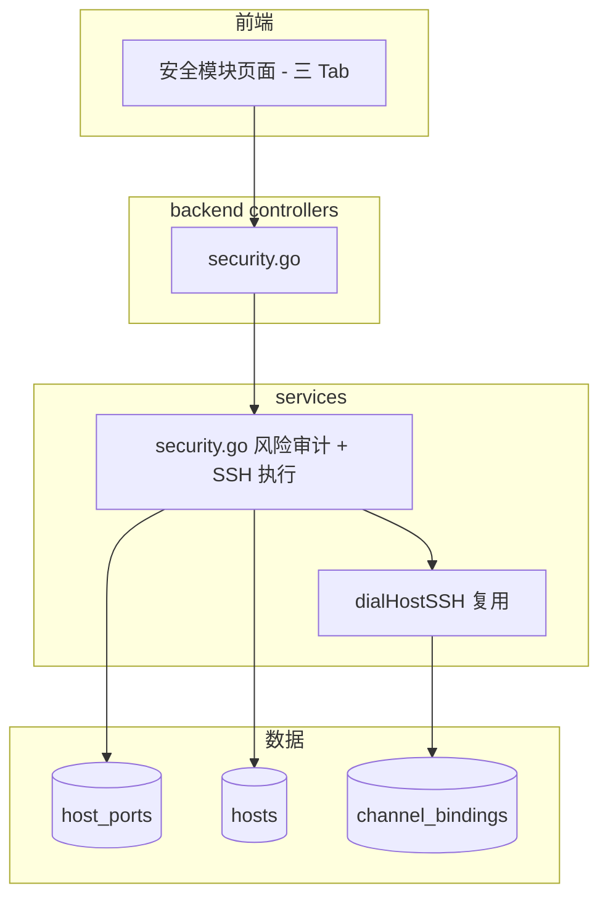

# 网络安全模块

Feature Name: network-security
Updated: 2026-09-15

## Description

为 MSMP 新增网络安全模块：端口暴露风险审计（纯后端计算）、安全基线检查（SSH 执行）、防火墙管理（SSH 执行）。复用既有 `host_ports` 端口清单与 `dialHostSSH` SSH 连接能力。

## Architecture



## Components

### services/security.go（新增）

```go
// 端口风险
type PortRisk struct {
    HostID    uint   `json:"host_id"`
    Hostname  string `json:"hostname"`
    PublicIP  string `json:"public_ip"`
    Port      int    `json:"port"`
    Proto     string `json:"proto"`
    Service   string `json:"service"`
    Level     string `json:"level"` // critical | warning
    Reason    string `json:"reason"`
    Suggestion string `json:"suggestion"`
}

func AuditPortRisks(tenantID uint) []PortRisk

// 基线检查
type BaselineItem struct {
    Name        string `json:"name"`
    Status      string `json:"status"` // pass | fail | warn | na
    Detail      string `json:"detail"`
    Suggestion  string `json:"suggestion"`
}

func RunBaselineCheck(hostID uint) ([]BaselineItem, error)

// 防火墙
func GetFirewallRules(hostID uint) ([]string, error)
func ManageFirewall(hostID uint, action string, port int, proto string) (string, error)
```

内置高风险端口表：22/3306/5432/6379/27017/9200/9300/2375/2376/11211/3389/1433/2049/445/5900/2379。

基线检查项（SSH 命令执行）：
1. SSH 允许 root 登录（sshd_config）
2. SSH 允许密码登录
3. 防火墙服务状态（firewalld/ufw）
4. SELinux 状态（getenforce，RHEL 系）
5. 空密码账户（检查 shadow）

### controllers/security.go + 路由

| Method | Path | 说明 |
|--------|------|------|
| GET | `/api/security/risks` | 端口暴露风险审计 |
| POST | `/api/security/baseline/{hostID}` | 执行基线检查 |
| GET | `/api/security/firewall/{hostID}` | 查看防火墙规则 |
| POST | `/api/security/firewall/{hostID}` | 开关端口 `{action, port, proto}` |

### 前端 Security.jsx

三个 Tab：端口风险（表格，等级 Tag）、安全基线（主机选择 + 执行 + 结果列表）、防火墙（主机选择 + 规则列表 + 开关端口表单）。

## Data Models

无新增持久化表，风险审计基于现有时序数据实时计算，基线/防火墙为按需执行（记录到 AuditLog）。

## Error Handling

- SSH 未配置 / 连接失败 → 返回 400 与明确提示。
- 防火墙类型无法识别 → 返回不支持。
- 危险端口表缺失服务名 → 标记 unknown。

## Test Strategy

- 单测：AuditPortRisks 风险判定（公网 IP / 监听地址 / 端口命中）。
- 集成：API 返回格式与字段完整性。
- 手动：真实 SSH 主机执行基线检查与防火墙操作。