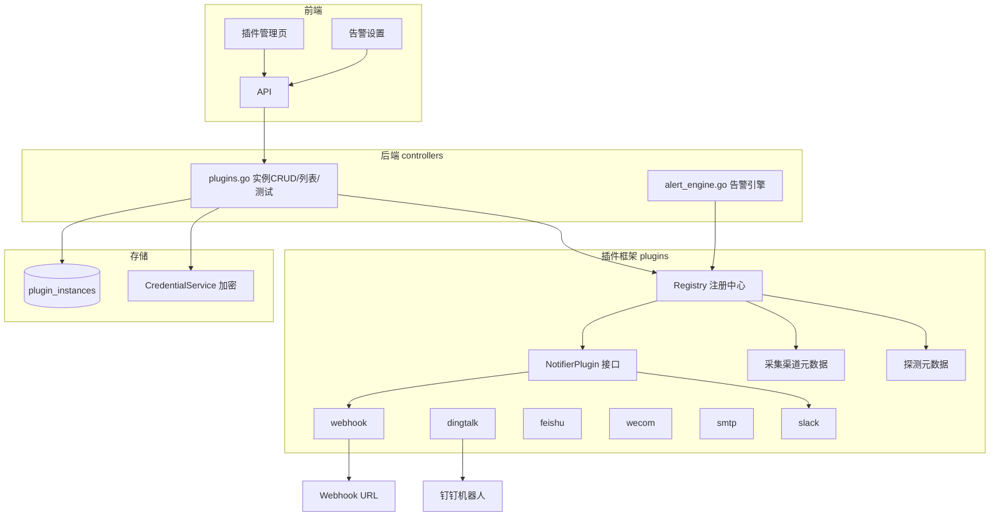

# 通用插件框架

Feature Name: plugin-framework
Updated: 2026-09-13

## Description

为 MSMP 引入统一的「插件框架」，将通知（notifier）、采集（collector）、探测（probe）三类可扩展能力统一纳管，提供插件元数据查询、通知插件实例化配置、启停与测试，并将告警分发从单一 Webhook 升级为「投递全部启用通知插件实例」。

插件采用**内置注册编译**：插件接口化 + 注册中心 + 编译进主程序，跨平台稳定。第一批落地 6 个通知插件：Webhook、钉钉、飞书、企业微信、邮件 SMTP、Slack。

## Architecture



分层职责：
- `plugins` 包：定义 `PluginMeta`、`NotifierPlugin` 接口、`Registry`，不依赖 controllers/models。
- `plugins` 内实现各通知插件，仅依赖 net/http 与第三方渠道协议，纯函数化便于单测。
- `controllers/plugins.go`：HTTP 层，做租户校验、加密解密、调用 Registry。
- `models.PluginInstance`：新增表，通过 `db.AutoMigrate` 自动迁移。

## Components and Interfaces

### 插件框架（新增 `server/plugins/`）

```go
type PluginType string

const (
    PluginTypeNotifier  PluginType = "notifier"
    PluginTypeCollector PluginType = "collector"
    PluginTypeProbe     PluginType = "probe"
)

type ConfigField struct {
    Key      string `json:"key"`
    Label    string `json:"label"`
    Type     string `json:"type"` // string | number | bool | secret | textarea
    Required bool   `json:"required"`
    Secret   bool   `json:"secret"`
    Default  string `json:"default,omitempty"`
}

type PluginMeta struct {
    ID           string        `json:"id"`
    Type         PluginType    `json:"type"`
    Name         string        `json:"name"`
    Description  string        `json:"description"`
    ConfigFields []ConfigField `json:"config_fields"`
}

type Notification struct {
    Title    string `json:"title"`
    Message  string `json:"message"`
    Level    string `json:"level"`
    Hostname string `json:"hostname"`
    HostUUID string `json:"host_uuid"`
    Time     string `json:"time"`
}

type NotifierPlugin interface {
    Meta() PluginMeta
    Send(ctx context.Context, cfg map[string]string, n Notification) error
    Test(ctx context.Context, cfg map[string]string) error
}

type Registry struct {
    notifiers map[string]NotifierPlugin
    all       []PluginMeta // 含 collector/probe 元数据
}

func NewRegistry() *Registry
func (r *Registry) RegisterNotifier(p NotifierPlugin)
func (r *Registry) List() []PluginMeta
func (r *Registry) GetNotifier(id string) (NotifierPlugin, bool)
```

collector / probe 元数据：由 `plugins` 包在初始化时静态登记（SSH/WAC/宝塔/1Panel/Prometheus/SNMP/WinRM/vSphere/PVE + http/tcp/ssl），仅用于 `/api/plugins` 展示，采集与探测执行继续复用 `collectors` 包与 `probes` 既有实现，不改动其行为。

### 通知插件（新增 `server/plugins/` 内实现）

| 插件 ID | 渠道 | 关键配置（敏感项加 *） |
|---------|------|----------------------|
| `notify-webhook` | 通用 Webhook | url* |
| `notify-dingtalk` | 钉钉群机器人 | access_token*、secret*、keyword |
| `notify-feishu` | 飞书群机器人 | webhook_url*、secret* |
| `notify-wecom` | 企业微信群机器人 | webhook_key* |
| `notify-smtp` | SMTP 邮件 | host、port、username、password*、from、to |
| `notify-slack` | Slack Incoming Webhook | webhook_url* |

钉钉/飞书需要请求签名（HmacSHA256），在插件内实现，纯函数便于单测。

### 数据模型（`server/models/models.go` 新增）

```go
type PluginInstance struct {
    ID        uint           `gorm:"primaryKey" json:"id"`
    TenantID  uint           `gorm:"index;not null" json:"tenant_id"`
    PluginID  string         `gorm:"size:64;not null" json:"plugin_id"`
    Type      string         `gorm:"size:16;not null;default:'notifier'" json:"type"`
    Name      string         `gorm:"size:128" json:"name"`
    Config    string         `gorm:"type:text" json:"-"` // JSON，敏感字段加密
    Enabled   bool           `gorm:"default:true" json:"enabled"`
    CreatedAt time.Time      `json:"created_at"`
    UpdatedAt time.Time      `json:"updated_at"`
    DeletedAt gorm.DeletedAt `gorm:"index" json:"-"`
}
```

敏感字段加密：复用 `services.CredentialService`。实例 JSON 配置中标记为 `secret` 的字段用 `cred.Encrypt` 加密后存储，返回响应时解密替换为空或掩码（如 `"****"`）。

### API（新增 `server/controllers/plugins.go`）

| 方法 | 路径 | 说明 |
|------|------|------|
| GET | `/api/plugins` | 列出内置插件元数据（含 collector/probe） |
| GET | `/api/plugins/instances` | 当前租户全部通知实例 |
| POST | `/api/plugins/instances` | 创建通知实例（校验 + 加密敏感项） |
| PUT | `/api/plugins/instances/{id}` | 更新实例（启用/禁用/改配置） |
| DELETE | `/api/plugins/instances/{id}` | 软删除实例 |
| POST | `/api/plugins/instances/{id}/test` | 发送测试通知 |

路由注册到 `main.go`，受现有 admin 角色中间件保护。

### 告警整合（`server/controllers/alerts.go` / `alert_engine.go`）

将 `notifyWebhook(event, host)` 替换为 `notifyAll(ctx, tenantID, notification)`：
1. 查询该租户全部 `enabled` 的通知实例（含解密后的配置）。
2. 逐个调用 `Registry.GetNotifier(...).Send`，失败打日志不中断。
3. 若无启用实例且 `notification.webhookurl` 已配置，回退到原 Webhook 行为（向后兼容）。

## Data Models

新表 `plugin_instances`（见上）。既有 `host_events`、`channel_bindings`、`avail_probes` 不变。

## Correctness Properties

- 插件实例严格租户隔离：所有 CRUD 均带 `tenant_id` 条件。
- 敏感配置字段落库前加密，接口响应不返回明文。
- 单个通知渠道投递失败不影响其余渠道，也不影响告警事件本身的落库（可观测性退化为日志）。
- 删除实例 = 软删除，告警分发查询天然排除。

## Error Handling

| 场景 | 处理 |
|------|------|
| 实例配置缺失必填字段 | 创建/更新返回 400 与具体字段名 |
| 插件 ID 不存在或类型非 notifier | 返回 400 |
| 敏感字段加密失败（密钥未配置） | 返回 503 |
| 测试通知渠道错误 | 返回 200 携带失败原因，不写告警 |
| 告警分发中单渠道失败 | log 记录，继续其余渠道 |

## Test Strategy

- 单测：钉钉/飞书签名算法（给定 key/timestamp 断言签名串）。
- 单测：SMTP 配置校验、通知消息模板渲染。
- 集成：`/api/plugins` 返回包含全部预期插件 ID；实例 CRUD 的租户隔离与敏感项掩码。
- 手动：真实钉钉/飞书/Slack 群机器人各发一条测试消息验证端到端。

## References

[^1]: server/collectors/channel.go — 采集渠道接口与注册表现状
[^2]: server/controllers/alerts.go — 既有 notifyWebhook 实现
[^3]: server/controllers/alert_engine.go — 告警触发与升级分发点
[^4]: server/services/ - CredentialService 加密服务